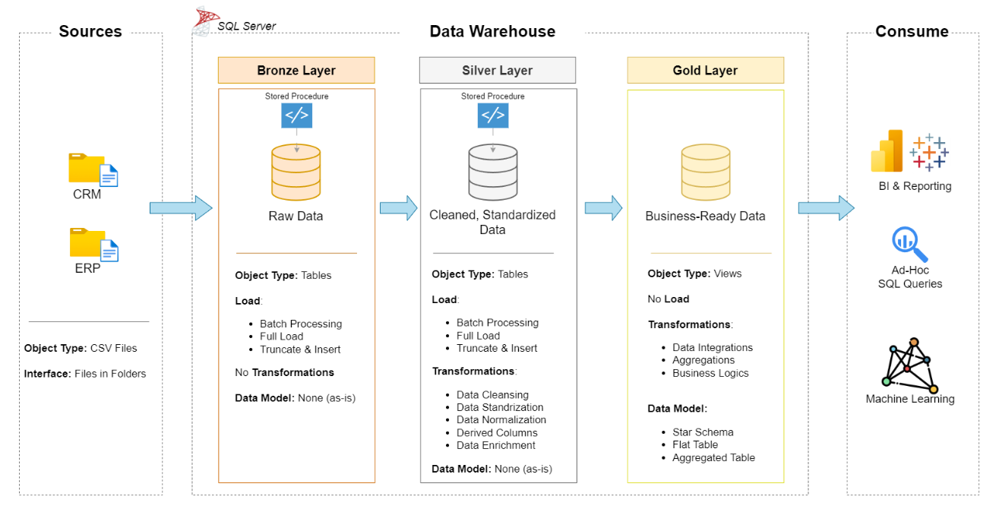

# Data-Warehouse-Project

This repository implements a SQL Server data warehouse using the medallion architecture.

## Overview
The project follows a layered approach:
- Bronze: raw and unchanged source data copied into the warehouse
- Silver: cleaned, standardized, and validated data
- Gold: business-ready analytical tables for reporting and BI



This architecture represents the end-to-end flow from source data ingestion through bronze, silver, and gold layers for analytics and reporting.

### Folder overview
- [scripts](scripts): SQL scripts for creating the database, defining each layer, and loading the warehouse objects.
- [docs](docs): project documentation, diagrams, and the data catalog for the warehouse model.
- [databases](databases): raw CSV source files from the CRM and ERP systems used as the base input for the warehouse.
- [tests](tests): validation and quality-check scripts used to verify the sliver -layer transformations and gold-layer objects.

## Bronze Layer
The bronze layer is the foundation of the warehouse. Its purpose is to preserve an exact or near-exact copy of the raw source data as it arrives from the CRM and ERP systems.

This layer is used for:
- tracing source values back to original files
- keeping a reliable snapshot before transformations
- supporting reprocessing when cleaning rules change
- acting as source of row data in case of debugging or comsuming from the upper layer

In this project, the bronze schema stores the raw CSV-based source data in tables such as:
- crm_cust_info
- crm_prd_info
- crm_sales_details
- erp_cust_az12
- erp_loc_a101
- erp_px_cat_g1v2


### Bronze Layer Diagram

The diagram in the draws folder shows the bronze layer as the raw ingestion area where CRM and ERP source data is stored before any cleaning or business-level transformations are applied.

The bronze tables are intentionally kept close to the source structure, with no transformations and no data modeling so that downstream silver and gold layers can be built from a trusted raw foundation.

## Silver Layer
The silver layer is the cleaned and standardized version of the bronze data. It is built to fix data-quality issues, normalize values, and prepare the records for downstream analytical use while still preserving business meaning.

### Silver layer transformation summary

#### 1) crm_cust_info
Issues found:
- duplicate customer IDs (cst_id)
- leading/trailing spaces in first and last names
- inconsistent marital status values (S/M)
- inconsistent gender values (M/F)

Transformation type:
- trim first and last names
- normalize marital status into Single/Married/n/a
- normalize gender into Male/Female/n/a
- keep only the most recent record per customer using ROW_NUMBER()

#### 2) crm_prd_info
Issues found:
- null product costs
- inconsistent product line codes (M/R/S/T)
- product key needs to be split for downstream alignment

Transformation type:
- derive cat_id from the product key prefix
- replace null cost with 0
- normalize prd_line values into business labels
- cast date columns to DATE
- derive prd_end_dt as one day before the next product start date

#### 3) crm_sales_details
Issues found:
- invalid or zero date values in order/ship/due dates
- missing or invalid sales and price values
- inconsistent sales/price relationships

Transformation type:
- convert numeric date strings to DATE
- set invalid dates to NULL
- derive sales value when sales is null or <= 0
- derive price value when price is null or <= 0

#### 4) erp_cust_az12
Issues found:
- customer IDs prefixed with NAS
- future birth dates
- inconsistent gender values (M/F and Male/Female)

Transformation type:
- remove NAS prefix to align with CRM customer key format
- replace future dates with NULL
- standardize gender values to Male/Female or n/a

#### 5) erp_loc_a101
Issues found:
- country codes need normalization
- IDs use AW- prefix and hyphen separation

Transformation type:
- normalize country names such as DE -> Germany and US/USA -> United States
- remove hyphen from AW IDs to match CRM key format
- replace blank or null country values with n/a

#### 6) erp_px_cat_g1v2
Issues found:
- category ID should align with crm_prd_info cat_id
- possible whitespace inconsistencies

Transformation type:
- trim values and validate alignment with downstream dimensions
- pass-through mapping with minimal transformation

The silver layer prepares the data for analytics by fixing quality issues while keeping the cleaned records still understandable and traceable to the source data.


## Gold Layer
the gold layer is the business-ready layer of the warehouse. It turns raw and cleaned data into a clean analytical model with:

- business-friendly column names
- standardized values
- surrogate keys for joins
- a star-schema structure for reporting

This enables dashboards, KPIs, and analytical queries without exposing the complexity of the raw source systems.

The gold layer contains three main business objects:

- `gold.dim_customers` — customer dimension
- `gold.dim_products` — product dimension
- `gold.fact_sales` — sales fact table

## Repository Structure

```text
Data-Warehouse-Project/
├── LICENSE
├── README.md
├── databases/
│   ├── placeholder
│   ├── source_crm/
│   │   ├── cust_info.csv
│   │   ├── prd_info.csv
│   │   └── sales_details.csv
│   └── source_erp/
│       ├── CUST_AZ12.csv
│       ├── LOC_A101.csv
│       └── PX_CAT_G1V2.csv
├── docs/
│   ├── data_catalog.md
│   ├── data_flow_diagram.png
│   ├── data_model.png 
│   └── integration_diagram.png
├── scripts/
│   ├── create_db.sql
│   ├── bronze/
│   │   ├── create_bronze_tables.sql
│   │   └── load_bronze_func.sql
│   ├── silver/
│   │   ├── create_silver_tables.sql
│   │   └── load_silver_function.sql
│   └── gold/
│       └── ddl_gold.sql
├── tests/
│   ├── test_gold.sql
│   └── test_silver.sql
└── .git/
```

This is the current repository layout used in the project, including source files, SQL layer scripts, documentation assets, and validation tests.


